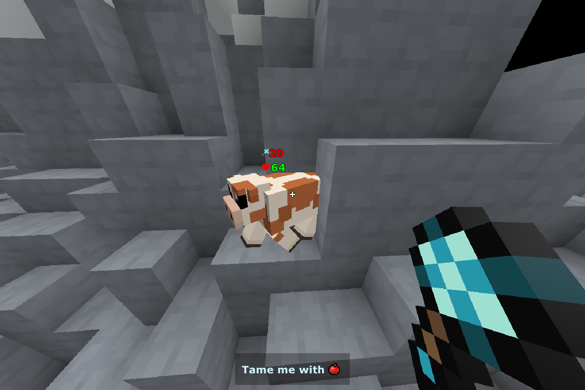
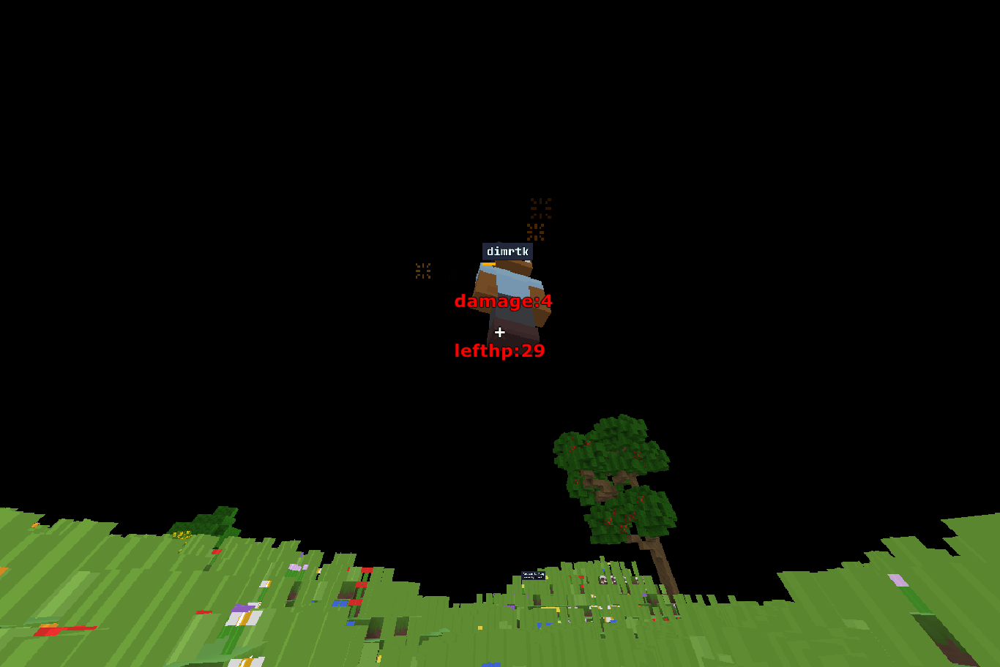

# 定義
<dl>
  <dt>当サーバー</dt>
  <dd>Bloxd 攻略 WikiのBloxdサーバー、「Wiki撮影用広場」</dd>
  <dt>当コード</dt>
  <dd>当サーバーでのワールドコード</dd>
  <dt>当プロジェクト</dt>
  <dd>BKW-codesリポジトリでの活動</dd>
</dl>

# 目的
改善前、当コードには大きな問題点がありました。
当時のコードについては[Old Lobby Code](./Old%20Lobby%20Code.js)を参照してください。
<p><strong>主な問題</strong></p>

- 大量のコールバック
  - ラグの原因となっていました。
- 認証システムの脆弱性
  - 名前に特定の文字列を含めるだけで管理者の判定を得られました。
- 無駄な機能
  - ショップなどの機能は本来の目的である撮影/検証から大きく外れていました。
  - 他にも邪魔な表示やスパムとなり得る要素がいくつかありました。

これらの改善のため、当プロジェクトは始動しました。

# 編集内容
## コマンド


### 評価

- [x] コマンド管理のためのコード編集が容易に。
- [x] ひとつのオブジェクトで管理でするため簡潔なコード

### 内容

```diff
- help
! customhelp
   カスタムコマンドのヘルプ

- clearGuide
-   RightInfoを非表示
! toggleShowRightInfo
!   RightInfoを表示/非表示

  aura
    経験値の情報を表示

- chat
-   broadcastする
+   通常チャットのみで十分であるため削除

  walk
    ブロックを通り抜け可能に

+ walks
+   ブロックを一括で通り抜け可能に

  stop
    ブロックを通り抜け不可に

+ stops
+   ブロックを一括で通り抜け不可に

- st
-   採掘速度測定をスタートする
+   採掘速度測定の予定がないため削除

- break
-   即時破壊ON
+   即時破壊による事故及び地形破壊防止のため削除

+ extraHP
+   体力増加をON/OFF

+ extraDamage
+   ダメージ増加をON/OFF

+ openMoonstoneChest
+   ムーンストーンチェストを開く

+ openChest
+   特定の座標のチェストを開く

  getPos
    座標を取得

  encha
    エンチャントする

+ instantEncha
+   その他設置を上書きするエンチャントする

  health
    特定プレイヤーのHPを取得

  clear
-   ホットバー以外のアイテムを削除
!   アイテムを削除(ホットバー保持も選択可能)

- sp
! togglehide
    プレイヤーを視認可能/不可能にする

  goodPos
    ブロックの中央に移動

+ clearPos
+   ブロックの端に移動

  extraTp
    特定座標にTPする（/tp pos の範囲外も対応）

- up
-   上方向に移動する

+ moveDirection
+   /moveでの移動方向の決定

+ move
+   特定量移動する

+ toggleShowDirection
+   X,Z方向を表示

- comReq
-   プレイヤーコンパス（/tp to や /tp here をクイック発動）を取得
! 迷惑な利用が確認されたため実装を検討中

  code
    コードを実行（編集者以上の権限が必要）

  clear
    インベントリを消去

+ getWikiPosition
+   BKWでのロールを確認
```

## BKWロール
### 評価
- [x] 大幅な簡略化
- [x] 脆弱性(名前に特定の文字を含ませることで編集者の判定を得られる問題)の対策
- [x] 名前からDbIdへ変更

### 内容
#### 旧版
```js
let wiki管理人 = ["aaa_"];
let wiki主要編集者 = ["Ryoku", "5kaideta_yuuto","yey_"];
let wiki編集者 = ["reiku_168_398", "1000yen","Bourei"];
```
```js
function isMobile(pid) {
    const MP = api.isMobile(pid);
    const name = api.getEntityName(pid);

    api.setClientOption(pid, 'lobbyLeaderboardInfo', {
        name: {
            displayName: "Name",
            sortPriority: 2,
        },
        deviceType: {
            displayName: "DeviceType",
            sortPriority: 3,
        },
        wiki: {
            displayName: "wiki編集者",
            sortPriority: 0,
        },
    });

    let device = MP ? "Mobile" : "PC";

    we = wiki編集者.some(el => name.includes(el));
    wa = wiki主要編集者.some(el => name.includes(el));
    wo = wiki管理人.some(el => name.includes(el));
    let wiki;
    let stpsf = api["setTargetedPlayerSettingForEveryone"];
    let cILL = "colorInLobbyLeaderboard";
    if (we) {
        wiki = "編集者";
        stpsf(pid, cILL, "lime", true);
    } else if (wa) {
        wiki = "主要編集者";
        stpsf(pid, cILL, "blue", true);
    } else if (wo) {
        wiki = "管理人";
        stpsf(pid, cILL, "yellow", true);
    } else {
        wiki = "なんでもない人";
        stpsf(pid, cILL, "white", true);
    }

    stpsf(pid, 'lobbyLeaderboardValues', {
        deviceType: device,
        wiki: wiki
    });

}
```
#### 新板
```js
const wikiPositions = [
    {
        name:"wiki管理人",
        color:"lime",
        level:3,
        pDbIds:[
            "h3UneKWxIbhyJNmqWZR2q",//aaa_
        ]
    },
    {
        name:"wiki主要編集者",
        color:"blue",
        level:2,
        pDbIds:[
            "Vqkj12sBFK_2wpcaFcWGz", //Ryokuryusei_
            //Bourei
            //1000yen
            //Zombiekun
            //yuuto
        ]
    },
    {
        name:"wiki編集者",
        color:"yellow",
        level:1,
        pDbIds:[
            //reiku
            "-rNnqMMTdKschR4LkpCja"//yey
        ]
    },
    {
        name:"閲覧者",
        color:"white",
        level:0,
        pDbIds:[]
    }
]
const customlobbyLeaderboardInfo = {
    name: {
        displayName: "Name",
        sortPriority: 2,
    },
    deviceType: {
        displayName: "DeviceType",
        sortPriority: 3,
    },
    wiki: {
        displayName: "wiki編集者",
        sortPriority: 0,
    }
};
```
```js
const customCms = {
    //中略
    getWikiPosition:{
  		settings:{
  			image: "fa-solid fa-lock-open",
  			description: "BKWでのロールを確認します",
  			onBoughtMessage: "表示しました",
  			buyButtonText: "確認"
  		},
  		code:function(pId,sendMessage=true) {
  			const pDbId = api.getPlayerDbId(pId);
  			let pWikiPosition = wikiPositions[wikiPositions.length-1];
  			wikiPositions.forEach(wikiPosition=>{
  				if(wikiPosition.pDbIds.includes(pDbId)) pWikiPosition = wikiPosition;
  			});
  			if(sendMessage) api.sendMessage(pId,[{str:"あなたのBKWでのロール: "},{str:pWikiPosition.name,style:{color:pWikiPosition.color}}]);
              return(pWikiPosition);
  		}
  	}
}
```

## ダメージ表示
新版: 旧版:

### 評価
- [x] より攻撃内容がわかりやすく
- [x] 簡略化
- [x] モブへの攻撃も反映

### 内容
#### 旧版
```js
onPlayerDamagingOtherPlayer = (attacker, damager, damage, item, bodyPartHit, damagerDbId) => {
    hp = api.getHealth(damager) - damage;
    api.sendFlyingMiddleMessage(attacker, [{ str: `damage:${String(damage)}\n\nlefthp:${hp}`, style: { color: "red" } }], 50);
};
```
#### 新版
```js
function sendDamageMessage(attacker,damager,damage,item) {
    const health = api.getHealth(damager) -damage,
        msg = [
            {icon:item,style:{fontSize:"16px"}},
            {str:String(damage),style:{color:"red"}}
        ];
    if(health >0) {
        msg.push(
            {str:"\n"},{icon:"fa-solid fa-heart",style:{color:"red",fontSize:"16px"}},
            {str:String(health),style:{color:"lime"}}
        );
    }
    api.sendFlyingMiddleMessage(attacker,msg,25);
}
onPlayerDamagingOtherPlayer = sendDamageMessage;
onPlayerDamagingMob = sendDamageMessage;
```

## Bショップ
### 評価
- [x] 不要/用途不明な機能(ポーションの購入など)の削除
- [x] コマンドを全てBショップ対応にして便利に

### 内容
#### 旧版
```js
onPlayerJoin = (pid) => {
    api.createShopItem("Command", "help", { image: "terminal", description: "コマンドヘルプを表示する", onBoughtMessage: "ヘルプをチャットに送信しました" });
    api.createShopItem("Command", "aura", { image: "Aura XP Potion", description: "今のオーラをリセットしてオーラの量を取得する", onBoughtMessage: "オーラを取得" });
    api.createShopItem("Command", "clear", { image: "trash-can", description: "インベントリ内のアイテムを消す（ホットバーを除く）", onBoughtMessage: "削除しました" });
    api.createShopItem("Command", "goodPos", { image: "crosshairs", description: "ブロックの真ん中に移動する", onBoughtMessage: "移動しました" });
    api.createShopItem("Command", "getaura", {
        userInput: { type: "text", placeholderText: "ゲットするオーラの値" },
        image: "Aura XP Potion", buyButtonText: "ゲット", description: "オーラを追加する", onBoughtMessage: "オーラをゲット"
    });
    api.createShopItem("Command", "comReq", {
        userInput: { type: "player", excludedPlayers: [] }, image: "Compass", buyButtonText: "入手", description: "指定したプレイヤー名のコンパスをゲットする", onBoughtMessage: "付与しました"
    });
    api.createShopItem("Command", "spawnMeshEntity", {
        //userInput: {type: "
        image: "head_1_0", description: "自分のスキンと同じメッシュを持ったエンティティをスポーンさせる", onBoughtMessage: "スポーンしました"
    });

    api.createShopItem("Shop", "coin", {
        image: "Gold Coin", customTitle: "Gold Coin", canBuy: true, buyButtonText: "購入", description: "10土を使用してコインをゲットする", onBoughtMessage: "購入しました"
    });
    api.createShopItem("Shop", "sp_speed", {
        image: "Splash Speed Potion", customTitle: "Splash Speed Potion", canBuy: true, buyButtonText: "購入", description: "1コインを使用してスプラッシュスピードポーションを入手する", onBoughtMessage: "購入しました"
    });
    api.createShopItem("Shop", "spear", {
        image: "Diamond Spear", customTitle: "Diamond Spear", canBuy: true, buyButtonText: "購入", description: "ダイヤモンドの槍を得る", onBoughtMessage: "付与しました",
    });
    //以下略
};
```
```js
onPlayerBoughtShopItem = (pid, categoryKey, itemKey, item, userInput) => {
    if (itemKey == "help") {
        getMsg(pid, 1077, 100, 964, (pid, data) => {
            api.sendMessage(pid, data);
        });
    } else if (itemKey == "aura") {
        const aura = api.getAuraInfo(pid).totalAura;
        api.sendMessage(pid, `${api.getAuraInfo(pid).totalAura / 100}%\n${aura}`);
        api.setTotalAura(pid, 0);
    } else if (itemKey == "clear") {
        for (let p = 10; p < 46; p++) { api.setItemSlot(pid, p, "Air") ;}
    } else if (itemKey == "goodPos") {
        let pPos = api.getPosition(pid);
        api.setPosition(pid, Math.floor(pPos[0]) + 0.5, Math.floor(pPos[1]), Math.floor(pPos[2]) + 0.5);
    } else if (itemKey == "getaura") {
        api.applyAuraChange(pid, Number(userInput));
    } else if (itemKey == "comReq") {
        api.broadcastMessage(userInput);
        api.giveItem(pid, "Compass", 1, { customDisplayName: api.getEntityName(userInput), customAttributes: { enchantmentTier: !userInput ? "Tier 1" : "Tier 5" } });
    } else if (itemKey == "spawnMeshEntity") {
        parts = ["hat", "head", "body", "legs", "shoes", "eyebrows", "eyes", "skin"];
        playerParts = [];
        for (let part of parts) {
            cosmetic = api.getPlayerCosmetic(pid, part);
            playerParts.push(cosmetic);
        }
        const meshEntityId = api.attemptCreateMeshEntity("Person", {
            size: 1,
            pose: "standing",
            autoRotate: true,
            textures: { hat: playerParts[0], head: playerParts[1], body: playerParts[2], legs: playerParts[3], shoes: playerParts[4], eyebrows: playerParts[5], eyes: playerParts[6], skin: playerParts[7] },
        }, api.getEntityName(pid));
        api.setPosition(meshEntityId, api.getPosition(pid));

        /* facing = api.getPlayerFacingInfo(pid);dir = facing.dir;
        x = dir[0];y = dir[1];z = dir[2];
        x = (x * 100).toFixed(2);y = (y * 100).toFixed(2);z = (z * 100).toFixed(2);
        x = Number(x);y = Number(y);z = Number(z);
        api.setCameraDirection(meshEntityId, [x,y,z]) */
    }


    if (itemKey == "coin" && categoryKey == "Shop") {
        if (9 < api.getInventoryItemAmount(pid, "Dirt")) {
            api.removeItemName(pid, "Dirt", 10);
            api.giveItem(pid, "Gold Coin", 1, {});
        } else {
            api.sendMessage(pid, "土が足りません");
        }
    } else if (itemKey == "sp_speed" && categoryKey == "Shop") {
        if (0 < api.getInventoryItemAmount(pid, "Gold Coin")) {
            api.removeItemName(pid, "Gold Coin", 1);
            api.giveItem(pid, "Splash Speed Potion", 1, {});
        } else {
            api.sendMessage(pid, "コインが足りません");
        }
    } else if (itemKey == "spear" && categoryKey == "Shop") {
        api.giveItem(pid, "Diamond Spear", 1, {});
    }
};
```
