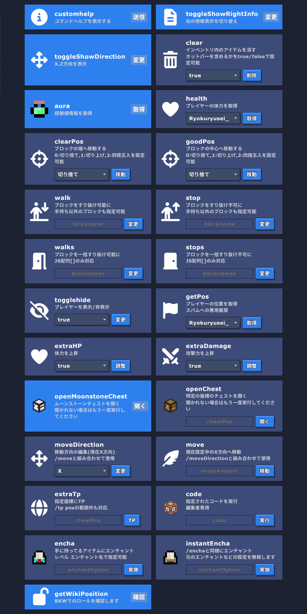

# 定義
<dl>
  <dt>当サーバー</dt>
  <dd>Bloxd 攻略 WikiのBloxdサーバー、「Wiki撮影用広場」</dd>
  <dt>当コード</dt>
  <dd>当サーバーでのワールドコード</dd>
  <dt>当プロジェクト</dt>
  <dd>BKW-codesリポジトリでの活動</dd>
</dl>

# 目的
改善前、当コードには大きな問題点がありました。
当時のコードについては[Old Lobby Code](./Old%20Lobby%20Code.js)を参照してください。
<p><strong>主な問題</strong></p>

- 大量のコールバック
  - ラグの原因となっていました。
- 認証システムの脆弱性
  - 名前に特定の文字列を含めるだけで管理者の判定を得られました。
- 無駄な機能
  - ショップなどの機能は本来の目的である撮影/検証から大きく外れていました。
  - 他にも邪魔な表示やスパムとなり得る要素がいくつかありました。

これらの改善のため、当プロジェクトは始動しました。

# 編集内容
## コマンド


### 新コード
定義部: [New Lobby Code 1~374](./New%20Lobby%20Code.js#L1-L386)

### 評価

- [x] コマンド管理のためのコード編集が容易に。
- [x] ひとつのオブジェクトで管理でするため簡潔なコード

### 内容

```diff
- help
! customhelp
   カスタムコマンドのヘルプ

- clearGuide
-   RightInfoを非表示
! toggleShowRightInfo
!   RightInfoを表示/非表示

  aura
    経験値の情報を表示

- chat
-   broadcastする
+   通常チャットのみで十分であるため削除

  walk
    ブロックを通り抜け可能に

+ walks
+   ブロックを一括で通り抜け可能に

  stop
    ブロックを通り抜け不可に

+ stops
+   ブロックを一括で通り抜け不可に

- st
-   採掘速度測定をスタートする
+   採掘速度測定の予定がないため削除

- break
-   即時破壊ON
+   即時破壊による事故及び地形破壊防止のため削除

+ extraHP
+   体力増加をON/OFF

+ extraDamage
+   ダメージ増加をON/OFF

+ openMoonstoneChest
+   ムーンストーンチェストを開く

+ openChest
+   特定の座標のチェストを開く

  getPos
    座標を取得

  encha
    エンチャントする

+ instantEncha
+   その他設置を上書きするエンチャントする

  health
    特定プレイヤーのHPを取得

  clear
-   ホットバー以外のアイテムを削除
!   アイテムを削除(ホットバー保持も選択可能)

- sp
! togglehide
    プレイヤーを視認可能/不可能にする

  goodPos
    ブロックの中央に移動

+ clearPos
+   ブロックの端に移動

  extraTp
    特定座標にTPする（/tp pos の範囲外も対応）

- up
-   上方向に移動する

+ moveDirection
+   /moveでの移動方向の決定

+ move
+   特定量移動する

+ toggleShowDirection
+   X,Z方向を表示

  comReq
    プレイヤーコンパス（/tp to や /tp here をクイック発動）を取得

  code
    コードを実行（編集者以上の権限が必要）
```
