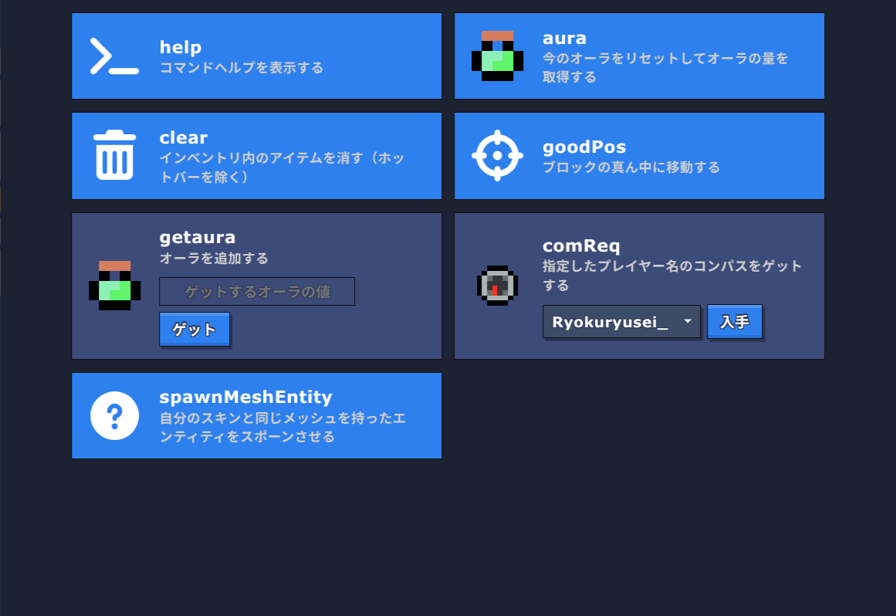

# 定義
<dl>
  <dt>当サーバー</dt>
  <dd>Bloxd 攻略 WikiのBloxdサーバー、「Wiki撮影用広場」</dd>
  <dt>当コード</dt>
  <dd>当サーバーでのワールドコード</dd>
  <dt>当プロジェクト</dt>
  <dd>BKW-codesリポジトリでの活動</dd>
</dl>


# 目的
改善前、当コードには大きな問題点がありました。
当時のコードについては[Old Lobby Code](./Old%20Lobby%20Code.js)を参照してください。
<p><strong>主な問題</strong></p>

- 大量のコールバック
  - ラグの原因となっていました。
- 認証システムの脆弱性
  - 名前に特定の文字列を含めるだけで管理者の判定を得られました。
- 無駄な機能
  - ショップなどの機能は本来の目的である撮影/検証から大きく外れていました。
  - 他にも邪魔な表示やスパムとなり得る要素がいくつかありました。

これらの改善のため、当プロジェクトは始動しました。


# 編集内容
## コマンド


### 機能概要
オリジナルの「/」から始まるコマンド

### 評価
- [x] コマンド管理のためのコード編集が容易に。
- [x] ひとつのオブジェクトで管理でするため簡潔なコード

```diff
- help
! customhelp
   カスタムコマンドのヘルプ

- clearGuide
-   RightInfoを非表示
! toggleShowRightInfo
!   RightInfoを表示/非表示

  aura
    経験値の情報を表示

- chat
-   broadcastする
+   通常チャットのみで十分であるため削除

  walk
    ブロックを通り抜け可能に

+ walks
+   ブロックを一括で通り抜け可能に

  stop
    ブロックを通り抜け不可に

+ stops
+   ブロックを一括で通り抜け不可に

- st
-   採掘速度測定をスタートする
+   採掘速度測定の予定がないため削除

- break
-   即時破壊ON
+   即時破壊による事故及び地形破壊防止のため削除

+ extraHP
+   体力増加をON/OFF

+ extraDamage
+   ダメージ増加をON/OFF

+ openMoonstoneChest
+   ムーンストーンチェストを開く

+ openChest
+   特定の座標のチェストを開く

  getPos
    座標を取得

  encha
    エンチャントする

+ instantEncha
+   その他設置を上書きするエンチャントする

  health
    特定プレイヤーのHPを取得

  clear
-   ホットバー以外のアイテムを削除
!   アイテムを削除(ホットバー保持も選択可能)

- sp
! togglehide
    プレイヤーを視認可能/不可能にする

  goodPos
    ブロックの中央に移動

+ clearPos
+   ブロックの端に移動

  extraTp
    特定座標にTPする（/tp pos の範囲外も対応）

- up
-   上方向に移動する

+ moveDirection
+   /moveでの移動方向の決定

+ move
+   特定量移動する

+ toggleShowDirection
+   X,Z方向を表示

- comReq
-   プレイヤーコンパス（/tp to や /tp here をクイック発動）を取得
! 迷惑な利用が確認されたため実装を検討中

  code
    コードを実行（編集者以上の権限が必要）

  clear
    インベントリを消去

+ getWikiPosition
+   BKWでのロールを確認
```


## BKWロール
### 機能概要
BKWにおける編集者などのロールをリーダーボードに表示する

### 評価
- [x] 大幅な簡略化
- [x] 脆弱性(名前に特定の文字を含ませることで編集者の判定を得られる問題)の対策
- [x] 名前からDbIdへ変更

### コード内容
<details>
<summary>旧版</summary>

```js
let wiki管理人 = ["aaa_"];
let wiki主要編集者 = ["Ryoku", "5kaideta_yuuto","yey_"];
let wiki編集者 = ["reiku_168_398", "1000yen","Bourei"];
```

```js
function isMobile(pid) {
    const MP = api.isMobile(pid);
    const name = api.getEntityName(pid);

    api.setClientOption(pid, 'lobbyLeaderboardInfo', {
        name: {
            displayName: "Name",
            sortPriority: 2,
        },
        deviceType: {
            displayName: "DeviceType",
            sortPriority: 3,
        },
        wiki: {
            displayName: "wiki編集者",
            sortPriority: 0,
        },
    });

    let device = MP ? "Mobile" : "PC";

    we = wiki編集者.some(el => name.includes(el));
    wa = wiki主要編集者.some(el => name.includes(el));
    wo = wiki管理人.some(el => name.includes(el));
    let wiki;
    let stpsf = api["setTargetedPlayerSettingForEveryone"];
    let cILL = "colorInLobbyLeaderboard";
    if (we) {
        wiki = "編集者";
        stpsf(pid, cILL, "lime", true);
    } else if (wa) {
        wiki = "主要編集者";
        stpsf(pid, cILL, "blue", true);
    } else if (wo) {
        wiki = "管理人";
        stpsf(pid, cILL, "yellow", true);
    } else {
        wiki = "なんでもない人";
        stpsf(pid, cILL, "white", true);
    }

    stpsf(pid, 'lobbyLeaderboardValues', {
        deviceType: device,
        wiki: wiki
    });

}
```
</details>

<details>
<summary>新板</summary>

```js
const wikiPositions = [
    {
        name:"wiki管理人",
        color:"lime",
        level:3,
        pDbIds:[
            "h3UneKWxIbhyJNmqWZR2q",//aaa_
        ]
    },
    {
        name:"wiki主要編集者",
        color:"blue",
        level:2,
        pDbIds:[
            "Vqkj12sBFK_2wpcaFcWGz", //Ryokuryusei_
            //Bourei
            //1000yen
            //Zombiekun
            //yuuto
        ]
    },
    {
        name:"wiki編集者",
        color:"yellow",
        level:1,
        pDbIds:[
            //reiku
            "-rNnqMMTdKschR4LkpCja"//yey
        ]
    },
    {
        name:"閲覧者",
        color:"white",
        level:0,
        pDbIds:[]
    }
]
const customlobbyLeaderboardInfo = {
    name: {
        displayName: "Name",
        sortPriority: 2,
    },
    deviceType: {
        displayName: "DeviceType",
        sortPriority: 3,
    },
    wiki: {
        displayName: "wiki編集者",
        sortPriority: 0,
    }
};
```

```js
const customCms = {
    //中略
    getWikiPosition:{
  		settings:{
  			image: "fa-solid fa-lock-open",
  			description: "BKWでのロールを確認します",
  			onBoughtMessage: "表示しました",
  			buyButtonText: "確認"
  		},
  		code:function(pId,sendMessage=true) {
  			const pDbId = api.getPlayerDbId(pId);
  			let pWikiPosition = wikiPositions[wikiPositions.length-1];
  			wikiPositions.forEach(wikiPosition=>{
  				if(wikiPosition.pDbIds.includes(pDbId)) pWikiPosition = wikiPosition;
  			});
  			if(sendMessage) api.sendMessage(pId,[{str:"あなたのBKWでのロール: "},{str:pWikiPosition.name,style:{color:pWikiPosition.color}}]);
              return(pWikiPosition);
  		}
  	}
}
```

</details>


## ダメージ表示
新版: 旧版:
### 機能概要
モブやプレイヤーを攻撃した際に攻撃の内容を表示

### 評価
- [x] より攻撃内容がわかりやすく
- [x] 簡略化
- [x] モブへの攻撃も同様に反映

### コード内容
<details>
<summary>旧版</summary>

```js
onPlayerDamagingOtherPlayer = (attacker, damager, damage, item, bodyPartHit, damagerDbId) => {
    hp = api.getHealth(damager) - damage;
    api.sendFlyingMiddleMessage(attacker, [{ str: `damage:${String(damage)}\n\nlefthp:${hp}`, style: { color: "red" } }], 50);
};
```

```js
onPlayerDamagingMob = (pId, mId, damage, item) => {
    lh = api.getHealth(mId);
    api.sendFlyingMiddleMessage(pId, [{ icon: item }, { str: String(damage), style: { color: "red" } }, { str: `(${lh})`, style: { color: "lightgray", fontSize: "10px" } },], 10);
    //以下略
};
```
</details>

<details>
<summary>新版</summary>

```js
function sendDamageMessage(attacker,damager,damage,item) {
    const health = api.getHealth(damager) -damage,
        msg = [
            {icon:item,style:{fontSize:"16px"}},
            {str:String(damage),style:{color:"red"}}
        ];
    if(health >0) {
        msg.push(
            {str:"\n"},{icon:"fa-solid fa-heart",style:{color:"red",fontSize:"16px"}},
            {str:String(health),style:{color:"lime"}}
        );
    }
    api.sendFlyingMiddleMessage(attacker,msg,25);
}
onPlayerDamagingOtherPlayer = sendDamageMessage;
onPlayerDamagingMob = sendDamageMessage;
```

</details>


## Bショップ
新版: 旧版: 

### 機能概要
Bキーを押した時に開くショップを介した様々な機能

### 評価
- [x] 不要/用途不明な機能(ポーションの購入など)の削除
- [x] コマンドを全てBショップ対応にして便利に

### コード内容
<details>
<summary>旧版</summary>

```js
onPlayerJoin = (pid) => {
    api.createShopItem("Command", "help", { image: "terminal", description: "コマンドヘルプを表示する", onBoughtMessage: "ヘルプをチャットに送信しました" });
    api.createShopItem("Command", "aura", { image: "Aura XP Potion", description: "今のオーラをリセットしてオーラの量を取得する", onBoughtMessage: "オーラを取得" });
    api.createShopItem("Command", "clear", { image: "trash-can", description: "インベントリ内のアイテムを消す（ホットバーを除く）", onBoughtMessage: "削除しました" });
    api.createShopItem("Command", "goodPos", { image: "crosshairs", description: "ブロックの真ん中に移動する", onBoughtMessage: "移動しました" });
    api.createShopItem("Command", "getaura", {
        userInput: { type: "text", placeholderText: "ゲットするオーラの値" },
        image: "Aura XP Potion", buyButtonText: "ゲット", description: "オーラを追加する", onBoughtMessage: "オーラをゲット"
    });
    api.createShopItem("Command", "comReq", {
        userInput: { type: "player", excludedPlayers: [] }, image: "Compass", buyButtonText: "入手", description: "指定したプレイヤー名のコンパスをゲットする", onBoughtMessage: "付与しました"
    });
    api.createShopItem("Command", "spawnMeshEntity", {
        //userInput: {type: "
        image: "head_1_0", description: "自分のスキンと同じメッシュを持ったエンティティをスポーンさせる", onBoughtMessage: "スポーンしました"
    });

    api.createShopItem("Shop", "coin", {
        image: "Gold Coin", customTitle: "Gold Coin", canBuy: true, buyButtonText: "購入", description: "10土を使用してコインをゲットする", onBoughtMessage: "購入しました"
    });
    api.createShopItem("Shop", "sp_speed", {
        image: "Splash Speed Potion", customTitle: "Splash Speed Potion", canBuy: true, buyButtonText: "購入", description: "1コインを使用してスプラッシュスピードポーションを入手する", onBoughtMessage: "購入しました"
    });
    api.createShopItem("Shop", "spear", {
        image: "Diamond Spear", customTitle: "Diamond Spear", canBuy: true, buyButtonText: "購入", description: "ダイヤモンドの槍を得る", onBoughtMessage: "付与しました",
    });
    //以下略
};
```
```js
onPlayerBoughtShopItem = (pid, categoryKey, itemKey, item, userInput) => {
    if (itemKey == "help") {
        getMsg(pid, 1077, 100, 964, (pid, data) => {
            api.sendMessage(pid, data);
        });
    } else if (itemKey == "aura") {
        const aura = api.getAuraInfo(pid).totalAura;
        api.sendMessage(pid, `${api.getAuraInfo(pid).totalAura / 100}%\n${aura}`);
        api.setTotalAura(pid, 0);
    } else if (itemKey == "clear") {
        for (let p = 10; p < 46; p++) { api.setItemSlot(pid, p, "Air") ;}
    } else if (itemKey == "goodPos") {
        let pPos = api.getPosition(pid);
        api.setPosition(pid, Math.floor(pPos[0]) + 0.5, Math.floor(pPos[1]), Math.floor(pPos[2]) + 0.5);
    } else if (itemKey == "getaura") {
        api.applyAuraChange(pid, Number(userInput));
    } else if (itemKey == "comReq") {
        api.broadcastMessage(userInput);
        api.giveItem(pid, "Compass", 1, { customDisplayName: api.getEntityName(userInput), customAttributes: { enchantmentTier: !userInput ? "Tier 1" : "Tier 5" } });
    } else if (itemKey == "spawnMeshEntity") {
        parts = ["hat", "head", "body", "legs", "shoes", "eyebrows", "eyes", "skin"];
        playerParts = [];
        for (let part of parts) {
            cosmetic = api.getPlayerCosmetic(pid, part);
            playerParts.push(cosmetic);
        }
        const meshEntityId = api.attemptCreateMeshEntity("Person", {
            size: 1,
            pose: "standing",
            autoRotate: true,
            textures: { hat: playerParts[0], head: playerParts[1], body: playerParts[2], legs: playerParts[3], shoes: playerParts[4], eyebrows: playerParts[5], eyes: playerParts[6], skin: playerParts[7] },
        }, api.getEntityName(pid));
        api.setPosition(meshEntityId, api.getPosition(pid));

        /* facing = api.getPlayerFacingInfo(pid);dir = facing.dir;
        x = dir[0];y = dir[1];z = dir[2];
        x = (x * 100).toFixed(2);y = (y * 100).toFixed(2);z = (z * 100).toFixed(2);
        x = Number(x);y = Number(y);z = Number(z);
        api.setCameraDirection(meshEntityId, [x,y,z]) */
    }


    if (itemKey == "coin" && categoryKey == "Shop") {
        if (9 < api.getInventoryItemAmount(pid, "Dirt")) {
            api.removeItemName(pid, "Dirt", 10);
            api.giveItem(pid, "Gold Coin", 1, {});
        } else {
            api.sendMessage(pid, "土が足りません");
        }
    } else if (itemKey == "sp_speed" && categoryKey == "Shop") {
        if (0 < api.getInventoryItemAmount(pid, "Gold Coin")) {
            api.removeItemName(pid, "Gold Coin", 1);
            api.giveItem(pid, "Splash Speed Potion", 1, {});
        } else {
            api.sendMessage(pid, "コインが足りません");
        }
    } else if (itemKey == "spear" && categoryKey == "Shop") {
        api.giveItem(pid, "Diamond Spear", 1, {});
    }
};
```

</details>

<details>
<summary>新版</summary>

```js
onPlayerJoin = (pId) => {
    for(let customCm in customCms) {
        api.createShopItem("Command",customCm,customCms[customCm].settings)
    }
    //中略
}
```
+コマンド定義部

</details>


## 参加時の右側情報テキスト表示
### 機能概要
右側情報テキストを設定する

### 評価
- [x] 簡略化

### コード内容
<details>
<summary>旧版</summary>

```js
onPlayerJoin = (pid) => {
	//中略
    getMsg(pid, 1077, 100, 966, (pid, data) => {
        api.setClientOption(pid, "RightInfoText", data);
    });
	//中略
};
```

</details>

<details>
<summary>新版</summary>

```js
const link = "htt" + "ps:/" + "/bloxd.wikiru." + "jp";
const customRightInfoText = [
    {str:"Bloxd攻略 Wiki\n\t\t\t\t撮影用広場\n",style:{color:"lime",fontSize:"20px"}},
    {str:"--------------------------------\n"},
    {str:"Basic Info\n",style:{color:"gold"}},
    {str:"・"},{icon:"fa-solid fa-globe",style:{color:"blue"}},{str:" Wikiru\n"},
    {str:`\t${link}\n`},
    {str:"・"},{icon:"youtube",style:{color:"red"}},{str:" YoutubeCh\n"},
    {str:"\t@Bloxd攻略Wiki動画用ch\n"},
    {str:"・"},{icon:"fa-solid fa-hammer",style:{color:"purple"}},{str:" 地形破壊禁止\n"},
    {str:"New Things\n",style:{color:"gold"}},
    //{str:"・Rodをもって右クリック!\n"},
    {str:"・[Coder向け] getMsg関数\n"},
    {str:"・[試験的] ショップメニュー\n\tCommandタブ\n\tspawnMeshEnt" + "ity\n"},
    {str:"Previous New Things\n",style:{color:"gold"}},
    {str:"・/helpコマンド\n"},
    {str:"・コンパスのtp機能\n"}
];
```
```js
onPlayerJoin = (pId) => {
	//中略
	customCms.toggleShowRightInfo.code(pId);
}
```

</details>


# そのままの機能
## 更新通知
### 機能概要
ワールドコードの更新をお知らせする機能
「World codeを更新しました」

### 理由
- 消す理由がないこと

### コード内容
<details>
<summary>現行版</summary>

```js
api.broadcastMessage("World codeを更新しました");
```

</details>


## コード実行
### 機能概要
文字列のコードを実行する

### 理由
- コードブロックでのこの機能の利用への影響を考慮

### コード内容
<details>
<summary>現行版</summary>

```js
function executeCode(codeString) {
    const func = new Function(codeString); func();
}
```

</details>


## 遅延実行/遅延取得
### 機能概要
予約された内容を遅れて実行する

### 理由
- 拡張性、利便性を考慮

### コード内容
<details>
<summary>現行版</summary>

```js
if (!globalThis.delayQueue) {
    globalThis.delayQueue = [];
}

function getMsg(pid, x, y, z, callback) {
    api.getBlock(x, y, z);
    globalThis.delayQueue.push({ pid, x, y, z, wait: 5, callback });
}

tick = () => {
    for (let i = globalThis.delayQueue.length - 1; i >= 0; i--) {
        const task = globalThis.delayQueue[i];
        task.wait--;
        if (task.wait <= 0) {
            const raw = api.getBlockData(task.x, task.y, task.z)?.persisted?.shared?.text;
            if (raw) {
                const data = eval(raw);
                if (typeof task.callback === "function") {
                    task.callback(task.pid, data);
                }
            }
            globalThis.delayQueue.splice(i, 1);
        }
    }
};
```

</details>


# アーカイブされた機能
## ダメージ変更機能
### 機能概要
特定のアイテムによるダメージを変更

### アーカイブ理由
- 目的/利益が不明
- 現在利用されていない

### コード内容
<details>
<summary>旧版</summary>

```js
const damageList = {
    "Gold Sword": 40,
};
const damagePerList = {
    "Gold Sword": 1.5
};

onPlayerDamagingOtherPlayer = (ap, dp, dd, item, body, dbid) => {
    if (Object.keys(damageList).includes(item)) {
        api.attemptApplyDamage({
            eId: ap, hitEId: dp, attemptedDmgAmt: damageList[item],
            withItem: "Kill Spikes"
        }) 
        return "preventDamage";
    }
    if (Object.keys(damagePerList).includes(item)) {
        api.attemptApplyDamage({
            eId: ap, hitEId: dp, attemptedDmgAmt: dd * damagePerList[item],
            withItem: "Kill Spikes"        
}
        );
        return "preventDamage";
    }
};
```

</details>


## キルログコード
### 機能概要
オリジナルキルログを出力

### アーカイブ理由
- 既にコメントアウトされていたため

### コード内容
<details>
<summary>旧版</summary>

```js
/* === ここからkillログコード === */
function doAllPlayers(func) {
    for (let id of api.getPlayerIds()) {
        func(id);
    }
}
/*
let killLog = {textTime: 0, textVisible: false, pIds : ""};

let tickCount = 0;
let yMax = 0
function tick() {
    tickCount++
    if(killLog.textVisible) {
        killLog.textTime++;
        if (killLog.textTime >= 100) {
            api.setClientOption(killLog.pIds, "middleTextLower", "");
                killLog.textVisible = false;
        }
    }
    if(tickCount %1 === 0) {
        pPos = 	api.getPosition(api.getPlayerId("Ryokuryusei_suisei_"))
        pY = pPos[1]
        if(pY !== Math.floor(pY)) {
            if(pY > yMax) {
                yMax = pY
                api.broadcastMessage(String(pY))
            }
        }
    }
    if(tickCount %20 === 0) {
        for(mId of globalThis.superMobs) {
            api.applyImpulse(mId,0,10,0)
            const mPos = api.getPosition(mId)
            const mNextPos = [mPos[0],mPos[1]+1,mPos[2]]
            const mBlock = api.getBlock(mNextPos)
            if(mBlock === "Air") {
                api.setBlock(mNextPos,"Dirt")
            }
        }
    }
}

onPlayerKilledOtherPlayer = (attackingPlayer, killedPlayer, damageDealt, withItem) => {
	
    doAllPlayers((id)=>{
        api.setClientOption(id, "middleTextLower",[
            {str:`${api.getEntityName(attackingPlayer) }`,style:{color:"yellow"}},
            {icon:withItem},
            {str:` ${api.getEntityName(killedPlayer)}`,style:{color:"red"}},
        ])
        killLog.pIds = id
    })
        killLog.textTime = 0
        killLog.textVisible = true 

    api.log(withItem)
    api.broadcastMessage([
        {str:`${api.getEntityName(attackingPlayer)} `,style:{color:"yellow"}},
        {icon:withItem},
        {str:` ${api.getEntityName(killedPlayer)}`,style:{color:"red"}},
    ])
}
*/
/* === ここまでKillログコード === */
```

</details>


## コンパスTP
### 機能概要
プレイヤー(対象)の名前が書かれたコンパスを
- 左クリック/投げる: /tp to 対象
- 右クリック: /tp here 対象
の効果を発揮するもの

### アーカイブ理由
- 不適切な利用(連打など)が確認されたため
- アーカイブするかどうかの投票を予定中

### コード内容
<details>
<summary>旧版</summary>

```js
onPlayerDropItem = (pId, x, y, z, item, val, fromI) => {
    if (comTp(pId, api.getItemSlot(pId, fromI), true)) {
        return "preventDrop";
    }
};
onPlayerClick = (pId, wasAlt) => {
    comTp(pId, api.getHeldItem(pId), !wasAlt);
};
```
```js
onPlayerJoin = (pid) => {
    //(中略)
    getMsg(pid, 1077, 100, 968, (pid, data) => { });
    //(中略)
}
```
```
function comTp (pId,held,to) {
	held = held?.attributes?.customDisplayName
	for(const targetId of api.getPlayerIds()) {
		if(api.getEntityName(targetId) === held) {
			if(to) {
				const msg = [{str:api.getEntityName(pId)},{str:" ⇛ "},{icon:"Purple Portal"},{str:"\n ⇛ "},{str:api.getEntityName(targetId)}]
				api.sendFlyingMiddleMessage(pId,msg,100)
				api.sendFlyingMiddleMessage(targetId,msg,100)
				api.setPosition(pId,api.getPosition(targetId))
			}else {
				const msg = [{str:api.getEntityName(pId)},{str:" ⇚ "},{icon:"Cyan Portal"},{str:"\n ⇚ "},{str:api.getEntityName(targetId)}]
				api.sendFlyingMiddleMessage(pId,msg,100)
				api.sendFlyingMiddleMessage(targetId,msg,100)
				api.setPosition(targetId,api.getPosition(pId))
			}
			return(true)
		}
	}
}

globalThis.comTp = comTp
```

</details>


## 投擲物ログ
### 機能概要
投擲物の着弾に関して、タイプ、時間、ヒット位置、発射元をログ出力する

### アーカイブ理由
- 投擲物に関する検証が予定されていないこと
- 無意識にスパムに利用される可能性があること

### コード内容
<details>
<summary>旧版</summary>

```js
globalThis.lastThrowableUse = {};
onPlayerUsedThrowable = (pId, throwableName, throwableEId) => {
    globalThis.lastThrowableUse[pId] = api.now();
};

onPlayerThrowableHitTerrain = (pId, throwableName, throwableEId) => {
    const lastUse = globalThis.lastThrowableUse[pId];
    const time = api.now() - lastUse;
    const pName = api.getEntityName(pId);
    const pPos = api.getPosition(pId);
    const ePos = api.getPosition(throwableEId);
    let text = `${throwableName}は${time}sかけて${pName}の位置から\n[`;
    for (let i = 0; i < 3; i++) {
        text += String(ePos[i] - pPos[i]) + ",";
    }
    text += "]に行きました";
    //api.broadcastMessage(text)
};
```
</details>


## ペット育成機能調整
### 機能概要
ペットを特定のアイテムを持って殴ることで特殊な効果を発揮する
- 共通: ペットを空腹にする
- 棒(Stick): 友情ポイント+2000
- 本(Book): 大好物を開示
- コードブロック(Code Block): 大好物、好物、苦手なものをログ出力

### アーカイブ理由
- ペット育成に関する検証が予定されていない/完了していること

### コード内容
<details>
<summary>旧版</summary>

```js
onPlayerDamagingMob = (pId, mId, damage, item) => {
    //中略
    let pet = api.getMobSetting(mId, "petInfo");
    pet.lastFedAt -= 1000000;
    if (item == "Stick") {
        pet.friendshipPoints += 20000;
    } else if (item == "Book") {
        pet.superlikedFoodKnown = true;
    } else if (item == "Code Block") {
        const tame = api.getMobSetting(mId, "tameInfo");
        api.sendMessage(pId, `大好物:${JSON.stringify(tame.likedFoods)}`);
        api.sendMessage(pId, `好物:${JSON.stringify(tame.neutralFoods)}`);
        api.sendMessage(pId, `苦手:${JSON.stringify(tame.dislikedFoods)}`);
    }
    api.setMobSetting(mId, "petInfo", pet);
};
```
</details>


## 戦利品レアリティ表示
### 機能概要
遺跡などに生成されるチェスト(Loot Chest)のTierを表示する機能

### アーカイブ理由
- 他の検証方法も見つかり、この機能が使われなくなったこと
- この検証が予定されていないことこと

### コード内容
<details>
<summary>旧版</summary>

```js
onPlayerAttemptOpenChest = (pId, x, y, z, isMoonstoneChest, isIronChest) => {
    const block = api.getBlock(x, y, z);
    const tier = api.getBlockData(x, y, z)?.perssted?.lootQuality;
    if (tier !== undefined && api.getBlockData(x, y, z)?.persisted !== undefined) {
        api.setClientOption(pId, "middleTextLower", String(tier));
        api.setBlock(x, y + 1, z, block.replace("Loot Chest", "Board"));
        api.setBlockData(x, y + 1, z, { persisted: { shared: { text: String(tier), textSize: 2 } } });
    }
}
```

</details>


## 採掘時間表示
### 機能概要
採掘開始とブロック破壊時の記録から採掘にかかった時間を取得する機能

### アーカイブ理由
- 他の検証方法(ストップウォッチ等)があること
- この検証が予定されていないことこと

### コード内容
<details>
<summary>旧版</summary>

```js
const change = { x: 10166, y: 10057, z: 10170 };
onPlayerChangeBlock = (pId, x, y, z, from, to, dropItem, fromInfo, toInfo) => {
    if (x == change.x && y == change.y && z == change.z && to == "Air") {
        now = Number(api.now());
        time = (now - globalThis.miningStart) / 1000;
        api.log(String(time));
    }
};

function start() {
    api.setBlock(10166.5, 10057, 10174.5, "Air");
    globalThis.miningStart = Number(api.now());
}
```

</details>


## BAN表示
### 機能概要
あらかじめ登録しておいたプレイヤーが参加した際に「banned: プレイヤー名」と表示する機能

### アーカイブ理由
- 実用性がないこと
- 誰も登録されていないこと

### 内容
<details>
<summary>旧版</summary>

```js
const banned = [];
onPlayerJoin = (pid) => {
	//中略
    if (banned.includes(api.getEntityName(pid))) {
        api.log(`banned: ${api.getEntityName(pid)}`);
    }
};
```

</details>


## 自ネームタグ消し
### 機能概要
自分のネームタグを消す機能

### アーカイブ理由
- 利用されていないこと
- 利用する利益がないこと

### コード内容
<details>
<summary>旧版</summary>

```js
function nameTagClear(pid) {
    api.setTargetedPlayerSettingForEveryone(pid, "nameTagInfo", { content: [], backgroundColor: "", }, true);
}
```

</details>
